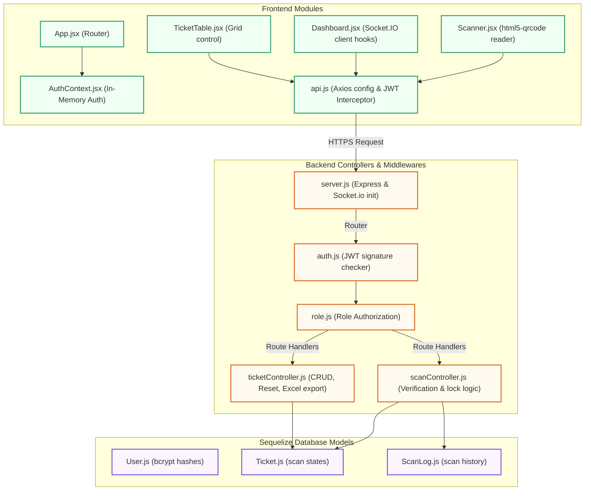
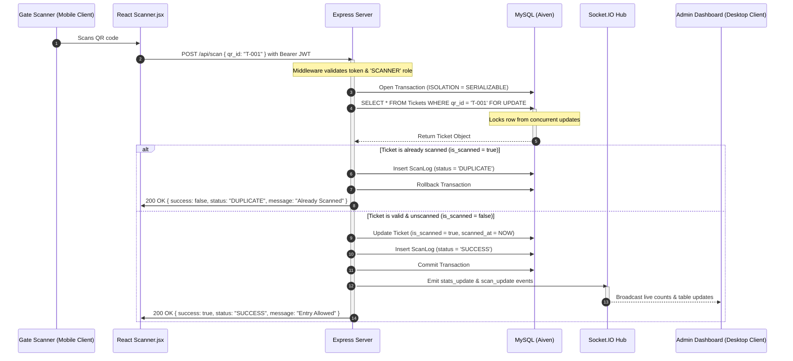

# 🎟️ Real-Time Event Entry & QR Verification System — Architecture

This document describes the design patterns, system flow diagrams, and architectural modules of the QR Verification System. It is divided into two sections: **High-Level Design (HLD)** (conceptual system structure) and **Low-Level Design (LLD)** (code modules, implementation sequences, and database locking flows).

---

## 🗺️ 1. High-Level Design (HLD)

The High-Level Design focuses on how the separate components of our cloud-hosted stack communicate with each other. The application is split into three tiers: **Presentation (Vercel)**, **Business Logic (Render)**, and **Database (Aiven)**.

### HLD System Diagram

This diagram maps the high-level boundaries and data paths of each hosting environment:

```mermaid
graph LR
    subgraph Clients ["Client Devices"]
        Scanner["Gate Scanner Device<br/>(Camera Capture)"]
        Admin["Admin Dashboard<br/>(Browser Grid)"]
    end

    subgraph Front ["Frontend Client (Vercel)"]
        C["React SPA Application<br/>(UI Views & Context)"]
    end

    subgraph Back ["Backend Services (Render)"]
        D["Express.js HTTP Server<br/>(REST API Routes)"]
        E["Socket.IO WebSocket Server<br/>(Real-Time Broadcasts)"]
    end

    subgraph Storage ["Database Service (Aiven)"]
        F[("MySQL Database Server<br/>(Persistent Tables)")]
    end

    %% High-level data paths
    Scanner -->|HTTPS Video Stream| C
    Admin -->|HTTPS Views| C
    C -->|REST Requests (HTTPS)| D
    C -->|WebSockets (WS/WSS)| E
    E -->|WebSockets (WS/WSS)| C
    D -->|Pessimistic Queries & Locks| F

    %% Apply Inline Styles (Fully compatible with all GitHub Markdown versions)
    style Scanner fill:#f4f9ff,stroke:#2b7de9,stroke-width:2px
    style Admin fill:#f4f9ff,stroke:#2b7de9,stroke-width:2px
    style C fill:#f0fff4,stroke:#38a169,stroke-width:2px
    style D fill:#fffaf0,stroke:#dd6b20,stroke-width:2px
    style E fill:#fffaf0,stroke:#dd6b20,stroke-width:2px
    style F fill:#faf5ff,stroke:#805ad5,stroke-width:2px
```

### High-Level Component Description
1.  **Frontend (Vercel)**: Serves a React Single Page Application (SPA). It captures video frames for scanning and displays live updating metric cards.
2.  **Backend Web Service (Render)**: Runs a Node.js Express server. It exposes endpoints to authenticate users, fetch ticket lists, and verify scan requests. It also operates a Socket.IO hub to broadcast status changes immediately.
3.  **Database Instance (Aiven)**: A fully managed MySQL instance. It stores table records for tickets, scan logs, and user credentials.

---

## ⚙️ 2. Low-Level Design (LLD)

The Low-Level Design defines the code modules, file relationships, security checks, and database concurrency mechanics.

### A. System Module Map
This flowchart shows the file-to-file routing pipelines and model accesses:



---

### B. Core Sequence Diagram (Scan Verification Loop)

To prevent double-scans (when multiple gates scan the exact same ticket ID at the same millisecond), the verification controller implements **Serializable Transactions** combined with a database **Pessimistic Row Lock** (`SELECT ... FOR UPDATE`). 

This sequence diagram details the database locking step and the subsequent WebSocket update loop:



---

### C. Low-Level Design Code References

1.  **Authentication Guard**: The [auth.js](file:///Users/alokkumarsingh/Desktop/node%20js/event/backend/middleware/auth.js) middleware extracts JWT tokens, verifies the signature against `process.env.JWT_SECRET`, and populates the `req.user` payload.
2.  **Concurrency Locking Engine**: The `scan` controller inside [scanController.js](file:///Users/alokkumarsingh/Desktop/node%20js/event/backend/controllers/scanController.js) invokes the Sequelize transaction:
    ```javascript
    const t = await sequelize.transaction({
      isolationLevel: Sequelize.Transaction.ISOLATION_LEVELS.SERIALIZABLE
    });
    ```
    And forces a pessimistic row lock during discovery:
    ```javascript
    const ticket = await Ticket.findOne({
      where: { qr_id },
      lock: t.LOCK.UPDATE,
      transaction: t
    });
    ```
3.  **Real-Time Sync Dispatcher**: In [server.js](file:///Users/alokkumarsingh/Desktop/node%20js/event/backend/server.js), `app.set('io', io)` makes Socket.IO accessible across files. The scan handler triggers broadcasts to update stats counters and administrative tables instantly.
