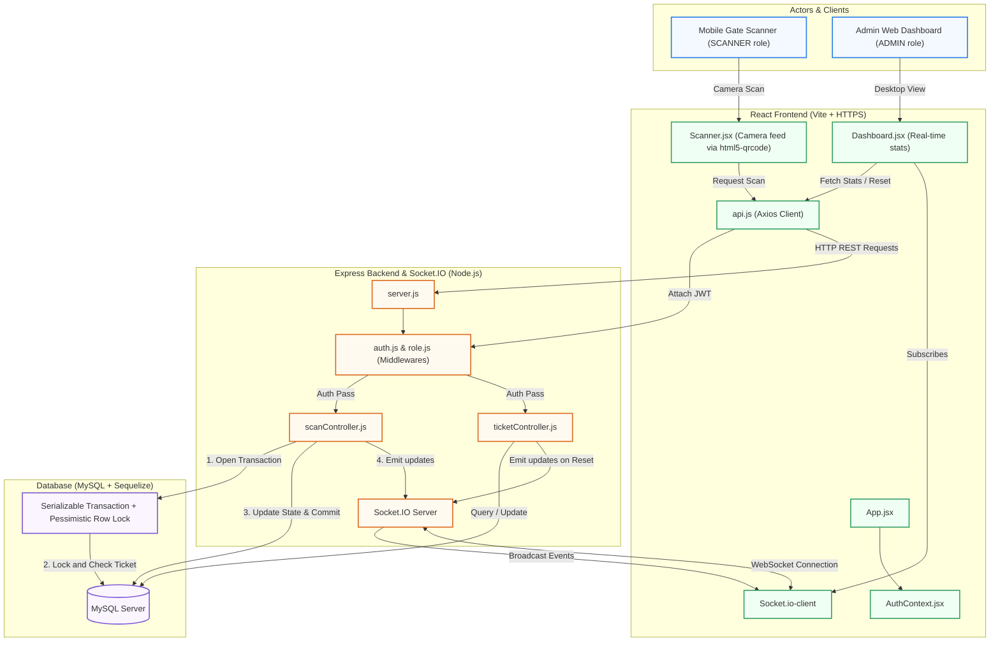

# 🎟️ Real-Time Event Entry & QR Verification System — Architecture

This document outlines the architecture, data flows, and concurrency handling in this project.

---

## 🏗️ Architecture Flow Diagram

---

## 🛠️ Key Design Patterns & Code Entrypoints

### 🔑 Authentication & Authorization
- **State Registry**: [AuthContext.jsx](file:///Users/alokkumarsingh/Desktop/node%20js/event/frontend/src/context/AuthContext.jsx) coordinates login credentials in-memory (preventing LocalStorage XSS exploits).
- **HTTP Interceptors**: [api.js](file:///Users/alokkumarsingh/Desktop/node%20js/event/frontend/src/services/api.js) automatically signs outbound requests with the Bearer JWT token.
- **Route Access Filters**: Express middlewares [auth.js](file:///Users/alokkumarsingh/Desktop/node%20js/event/backend/middleware/auth.js) and [role.js](file:///Users/alokkumarsingh/Desktop/node%20js/event/backend/middleware/role.js) check permissions for administrative operations (resets, Excel reporting).

### ⚡ Race-Condition Prevention (Pessimistic Locking)
To safeguard ticket verification against double-scans occurring in parallel, the scan pipeline uses strict isolation:
1. Opens a Sequelize transaction at the `SERIALIZABLE` isolation level.
2. Performs a lookup query with `lock: t.LOCK.UPDATE` (translates to MySQL's `SELECT ... FOR UPDATE` row lock).
3. Holds the lock on the target ticket until status checks and logs are committed/rolled back, forcing concurrent scans to queue.

*Implementation Reference:* [scanController.js](file:///Users/alokkumarsingh/Desktop/node%20js/event/backend/controllers/scanController.js).

### 📡 WebSocket Sync
- **Server Entrypoint**: [server.js](file:///Users/alokkumarsingh/Desktop/node%20js/event/backend/server.js) initializes the `Socket.IO` server, attaching it to the main HTTP engine.
- **Broadcast Signals**:
  - `stats_update`: Emailed upon successful ticket verification or resets to sync all connected dashboards.
  - `scan_update`: Broadcasts individual scan event status codes (`SUCCESS`, `DUPLICATE`, `INVALID`) and timestamps.
- **Dashboard Hooks**: [Dashboard.jsx](file:///Users/alokkumarsingh/Desktop/node%20js/event/frontend/src/pages/Dashboard.jsx) hooks into this socket and triggers component-level updates on event updates.

---

## 📁 Data Models

- **User**: [User.js](file:///Users/alokkumarsingh/Desktop/node%20js/event/backend/models/User.js) (username, hashed password, role: `ADMIN` or `SCANNER`).
- **Ticket**: [Ticket.js](file:///Users/alokkumarsingh/Desktop/node%20js/event/backend/models/Ticket.js) (unique string `qr_id`, boolean status `is_scanned`, scanned timestamp).
- **ScanLog**: [ScanLog.js](file:///Users/alokkumarsingh/Desktop/node%20js/event/backend/models/ScanLog.js) (historical entries, documenting verification state: `SUCCESS`, `DUPLICATE`, `INVALID`).
